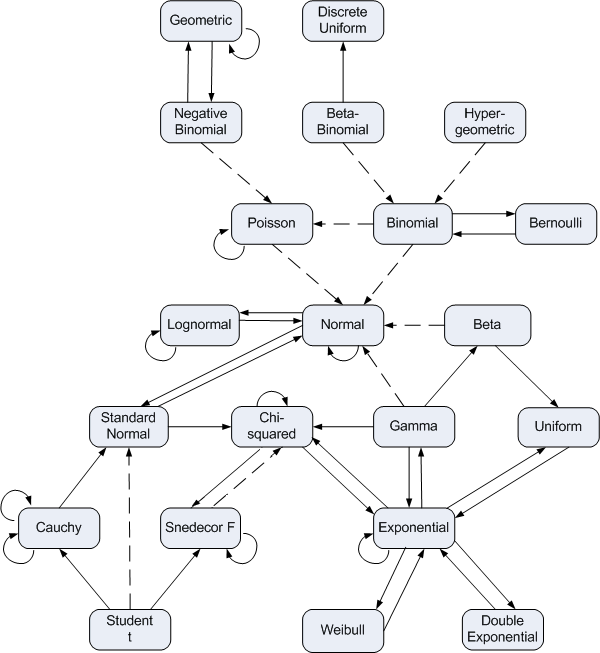

# Tutorial 1 Notes 

The goal of this tutorial are:

1. to have a mental model of the data structure for table-like data
2. to be able to do data manipulation with `data.table` package
3. to review three basic probability distributions:
    - Binomial
    - Poisson
    - Normal

## Definition of Binomial Distribution

The binomial distribution is the discrete probability distribution of the number of successes in a sequence of n independent experiments, each asking a yes–no question, and each with its own Boolean-valued outcome: success/yes/true/one (with probability p) or failure/no/false/zero (with probability q = 1 − p). A single success/failure experiment is also called a Bernoulli trial or Bernoulli experiment and a sequence of outcomes is called a Bernoulli process. If p is the probability of success in an individual experiment, then the probability mass function (pmf) of the number of successes x in n Bernoulli trials is given by the binomial distribution formula.

The binomial distribution is the basis for the popular binomial test of statistical significance. It is also a basis for the popular binomial option pricing model used in finance.

$$
\begin{aligned}
P(X = x) &= \binom{n}{x} p^x (1-p)^{n-x} \\
&= \frac{n!}{x!(n-x)!} p^x (1-p)^{n-x}
\end{aligned}
$$

## Definition of Poisson Distribution

The Poisson distribution is a discrete probability distribution that expresses the probability of a given number of events occurring in a fixed interval of time and/or space if these events occur with a known constant rate and independently of the time since the last event. The Poisson distribution can also be used for the number of events in other specified intervals such as distance, area or volume.

The Poisson distribution is named after the French mathematician Siméon Denis Poisson. It can also be regarded as a limit of the binomial distribution for large N.

$$
\begin{aligned}
P(X = x) &= \frac{\lambda^x e^{-\lambda}}{x!} \\
&= \frac{\lambda^x}{x!} e^{-\lambda}
\end{aligned}
$$

## Definition of Normal Distribution

In probability theory, a normal (or Gaussian or Gauss or Laplace–Gauss) distribution is a type of continuous probability distribution for a real-valued random variable. The general form of its probability density function is:

$$
f(x) = \frac{1}{\sigma \sqrt{2 \pi}} e^{-\frac{1}{2} \left( \frac{x - \mu}{\sigma} \right)^2}
$$

where $\mu$ is the mean and $\sigma$ is the standard deviation. The parameter $\sigma$ is called the scale parameter or the standard deviation of the distribution. The normal distribution is important in statistics and is often used in the natural and social sciences to represent real-valued random variables whose distributions are not known. For example, it approximates a wide variety of events, such as the distribution of samples influenced by a large number of tiny, random disturbances, such as thermal noise, or the forces exerted by many molecules on one's body.

The normal distribution is also a good model for the distribution of sample means for a large number of samples, especially if the true population from which the samples are taken is normally distributed. This is because the distribution of the mean of a large number of samples is approximately normally distributed, regardless of the distribution of the population from which the samples are taken. This is known as the central limit theorem.

## Connection between Binomial and Poisson Distribution

Both binomial and Poisson distributions are discrete probability distributions. The binomial distribution is used to model the number of successes in a sequence of independent trials, while the Poisson distribution is used to model the number of events occurring in a fixed interval of time or space.

There is a close connection between the binomial and Poisson distributions. The Poisson distribution can be derived from the binomial distribution by taking the limit of the number of trials as the number of trials approaches infinity, while keeping the probability of success constant.

Here is the connection of all distributions.

Now, we will show the connection between binomial and Poisson distribution based on [this lecture notes](https://mathcenter.oxford.emory.edu/site/math117/connectingPoissonAndBinomial/).

For binomial distribution, we have the following probability mass function:

$$
P(X = x) = \binom{n}{x} p^x (1-p)^{n-x}
$$

Now let's set up the parameters for the binomial distribution with $n$ and $\lambda$, such as 

$$
p = \frac{\lambda}{n}
$$

Then the binomial distribution can be rewritten as:

$$
P(X = x) = \binom{n}{x} \left( \frac{\lambda}{n} \right)^x \left( 1 - \frac{\lambda}{n} \right)^{n-x}
$$

Let's expand the above function and take the limit of $n$ as $n \to \infty$:

$$
\begin{aligned}
P(X = x) &= \lim_{n \to \infty} \binom{n}{x} \left( \frac{\lambda}{n} \right)^x \left( 1 - \frac{\lambda}{n} \right)^{n-x} \\
&= \lim_{n \to \infty} \frac{n!}{x! (n-x)!} \left( \frac{\lambda}{n} \right)^x \left( 1 - \frac{\lambda}{n} \right)^{n-x} \\
& = \lim_{n \to \infty} \frac{n(n-1)(n-x+1)}{x!} \frac{\lambda^x}{n^x} \left( 1 - \frac{\lambda}{n} \right)^{n-x} \\
& = \lim_{n \to \infty} \frac{n(n-1)(n-x+1)}{n^x} \frac{\lambda^x}{x!} \left( 1 - \frac{\lambda}{n} \right)^{n-x} \\
& = \lim_{n \to \infty} \frac{n(n-1)(n-x+1)}{n^x} \frac{\lambda^x}{x!} \left( 1 - \frac{\lambda}{n} \right)^{n} \left( 1 - \frac{\lambda}{n} \right)^{-x} \\
& = \frac{e^{-\lambda} \lambda^x }{x!} 
\end{aligned}
$$

The above derivation uses the following facts:

$$
\begin{aligned}
\lim_{n \to \infty} \frac{n(n-1)(n-x+1)}{n^x} &= 1 \\
\lim_{n \to \infty} \left( 1 + \frac{x}{n} \right)^{n} &= e^x \\
\lim_{n \to \infty} \left(1 - \frac{\lambda}{n} \right)^{-x} &= 1
\end{aligned}
$$

Therefore, we can conclude that the Poisson distribution is the limit of the binomial distribution for large $n$. But what is the intuition behind this connection?

Let's take a look at the following example:

> Now, suppose you are a restaurant owner and you want to know how many customers will come to your restaurant from 10am to 11am. 

## Case Study with Our Survey Data

Q1: have you learned regression before?

| q1  | N  | percent |
|:---:|:--:|:-------:|
| no  | 7  |  29.17  |
| yes | 17 |  70.83  |